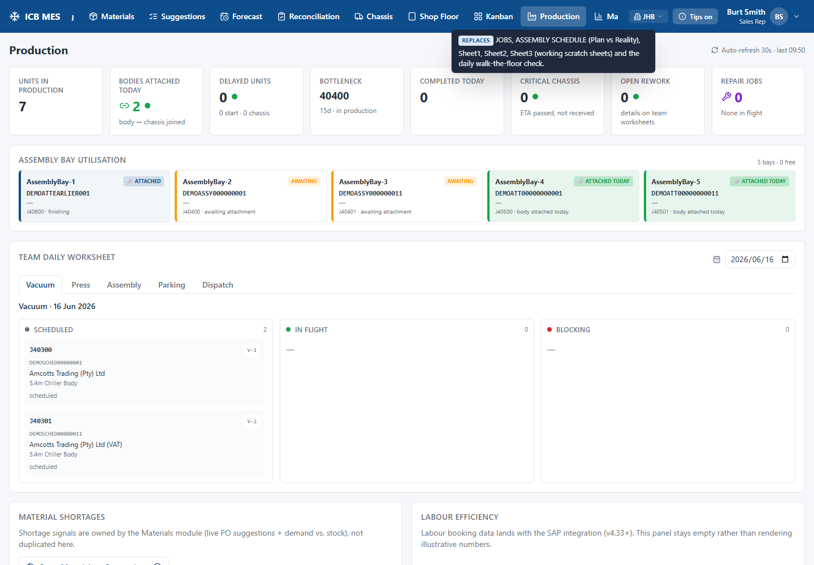
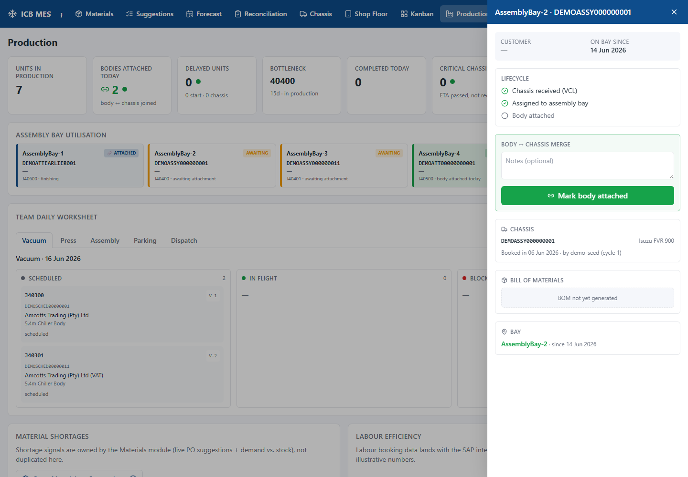
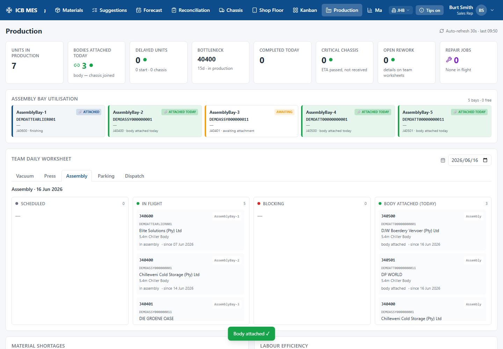
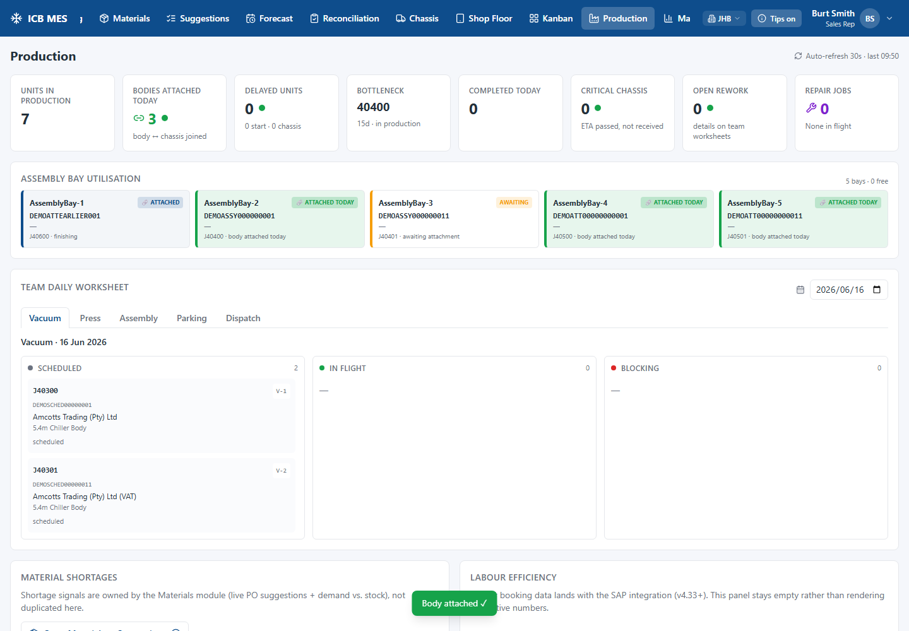
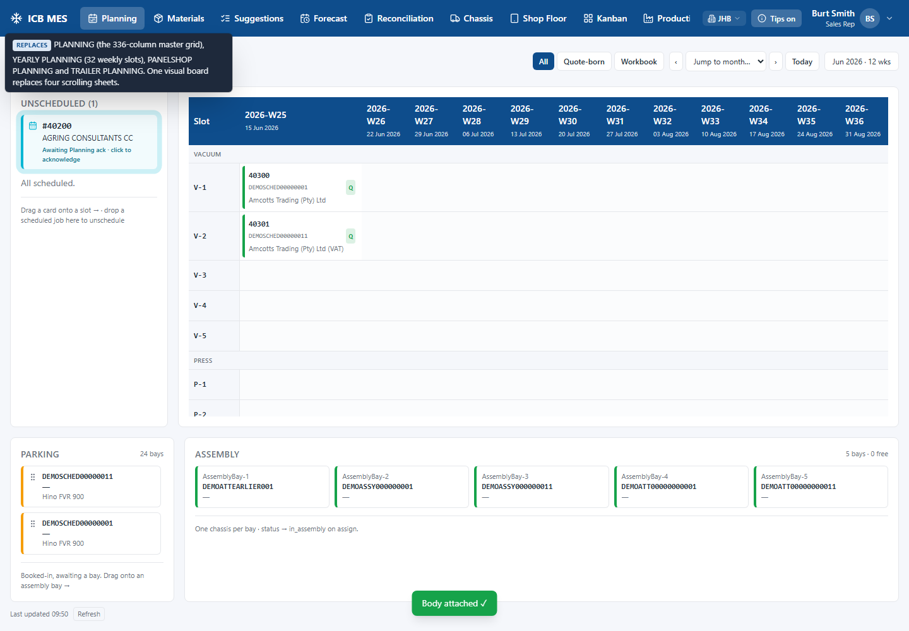
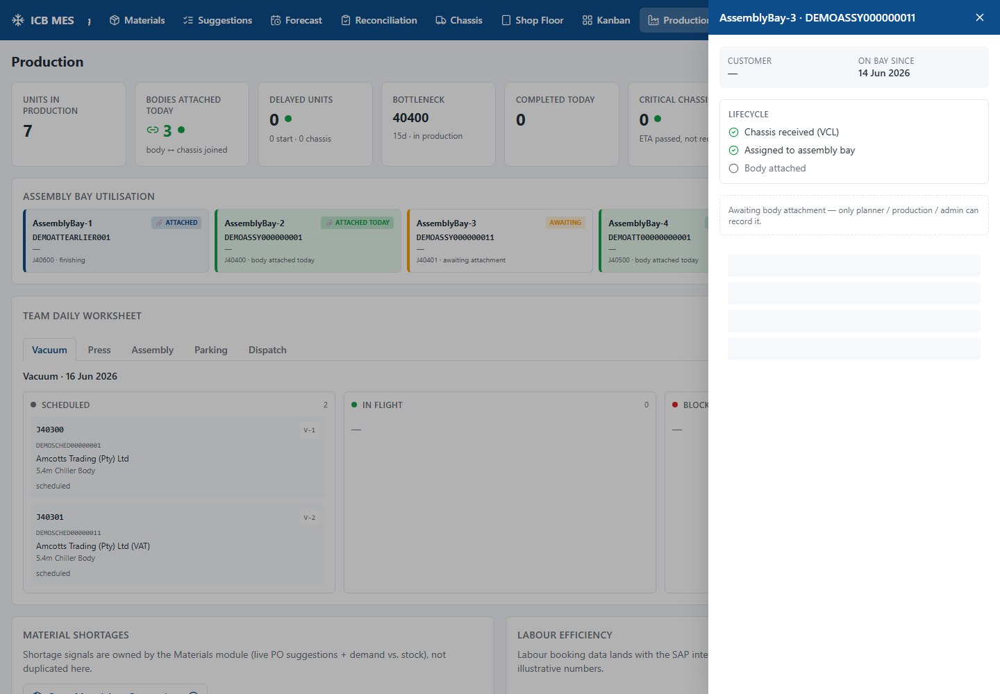

# Burt Demo Runbook — v4.35 (Body↔Chassis Attached) — v1.0

A step-by-step walkthrough for the 22-23 June owner demo. The story: a costing becomes a job, the job is
planned, the chassis arrives and goes to an assembly bay, **the body is joined to the chassis**, and the
floor sees it happen. Screenshots are from the live demo data; your screen will match after the
pre-demo reset below.

---

## ⛔ DO NOT SKIP — run this once, Monday AM, before you open the laptop for Burt

The demo data is throwaway and you may have clicked around it. Restore the canonical state:

```
cd backend
$env:ICB_ALLOW_SHARED_DB_WRITE = '1'          # PowerShell (deliberate friction — see ADR 0023)
python -m scripts.seed_v4_35_demo_reset --commit
python -m scripts.health_check                 # expect: CLEAN — all three invariants hold
```

This wipes the workflow data and reseeds the canonical demo (12 jobs, all bay states), preserving all
master data (customers, templates, users). It takes a few seconds. The script is idempotent — safe to
re-run. (A pre-wipe pg_dump snapshot already exists; the script is also atomic + invariant-gated.)

Then start the app the usual way and open **Production**.

---

## The walkthrough

### 1 · Production Dashboard — the floor at a glance
Open **Production**. The top strip leads with the keystone metric — **Bodies attached today** — beside
the live floor KPIs. Below it, the five assembly bays show their state at a glance.



**Talk track:** "This is the workshop floor. Two bodies have been joined to their chassis today. Each bay
tile shows what's in it and where it is in the join: amber = chassis waiting for its body, green = body
attached today, blue = finishing."

*If Burt asks "what's a bay state?"* — point at the colours: **AssemblyBay-2/-3 (amber, Awaiting)**,
**-4/-5 (green, Attached today)**, **-1 (Finishing)**.

### 2 · The bay detail + the join moment
Click **AssemblyBay-2** (amber). The side panel shows the **lifecycle checklist** — Chassis received ✓,
Assigned to assembly bay ✓, Body attached ○ — and the **Mark body attached** action.



**Talk track:** "The chassis is in the bay; the body isn't on yet. When the team joins them, we record it
right here." Type an optional note, click **🔗 Mark body attached**.


The bay turns green ("Attached today"), the **Bodies attached today** KPI ticks up, and a confirmation
shows. *That's the keystone — the moment the MES represents the factory joining the body to the chassis.*

### 3 · Where it shows up — Assembly tab
In the **Team daily worksheet**, open the **Assembly** tab. A **"Body Attached (today)"** section lists
the jobs joined today.



### 4 · Tracing it back — Vacuum/Press + Planning
The panel side of the floor knows the chassis too. The **Vacuum** tab shows each slot's chassis **VIN**
under the job number; the **Planning Board** shows the same on its scheduled cells — so a planner can
match VIN-to-VIN without a lookup.




### 4b · The panel side meets the chassis — drag-to-merge (Planning) · §3.3b
On the **Planning Board**, the five assembly bays sit just below the week grid. Drag a scheduled
**Vacuum/Press** job's slot-cell down onto an assembly bay — the bays light up as drop targets. Dropping
records that the job's **panels have arrived** in that bay:

- If the bay already holds **that job's chassis**, it turns **violet — "Ready to merge"** and an
  **auto-merge prompt** offers to mark the body attached now. Confirm runs the same body_attached
  chokepoint as the Production "Mark body attached" button — the bay flips green.
- If the chassis isn't on the bay yet, the bay shows **sky — "Pre-assembly"** (panels staged) until the
  chassis arrives, then becomes Ready to merge.

One job's panels live in exactly one bay, and one bay holds one job's panels — a second/duplicate drop is
rejected with a clear toast (the backend is the source of truth, not the UI). If panels land on a bay whose
chassis is a **different** job, the bay flags **"⚠ Different jobs"** (red) and names the stray panels — they
won't merge; click **"✕ move panels back"** on the bay to undo a wrong drop (no reseed needed), then re-drop
on the right bay. Switching back to the **Production** tab reflects any change automatically
(refetch-on-focus) — no reload needed.

*(Supplementary frames — Pre-assembly tile, Ready-to-merge tile, the auto-merge prompt — are captured
against the canonical reseed via `frontend/scripts/capture-v435-stretch.mjs` and added here in the final
pre-dry-run pass.)*

### 5 · Roles — the floor is read-only for the workshop
Signed in as a workshop user, the bay panel shows the state but **no Mark-body-attached button** — the
floor *sees* the workflow; recording it is the planner/production role (the tablet write-path is a future
step).



---

## Notes for the presenter

- **"The status fields didn't change after I attached the body — is that a bug?"** No — by design (ADR
  0025). **Status fields (chassis: `in_assembly`, job: `planning`) stay at pre-attachment values; status
  promotion lands with the v4.36 QC sprint. The bay tile + KPI + Assembly section tell the body_attached
  story.** The *event* is the meaningful moment, not a status flip — both "stale-looking" fields are
  deliberate and parallel (a future workshop-tablet step promotes them).
- **Bay vocabulary is 6 states** (the §3.3b Planning panel-drag enhancement shipped): Available ·
  **Pre-assembly** (a job's panels are in the bay, chassis not yet there) · **Ready to merge** (panels +
  chassis, *same job* — the auto-merge prompt offers to attach) · Awaiting attachment (chassis on the bay,
  panels not yet there) · Attached today · Finishing.
- **If Burt asks about email / SAP / materials** — those are blocked on the intranet/Marnus work and out
  of scope for this demo; the flow shown is the production workflow as designed.
- **If a bay won't mark attached** — it's guarded: the job must be in production, the chassis must be on
  the bay, and if a VIN was attested at planning-ack the chassis must match. The error toast says which.

## Reset between dry-runs
If you mark a body attached during a dry-run and want the two amber bays back, just re-run the
**DO NOT SKIP** reset above. It restores the canonical state every time.
